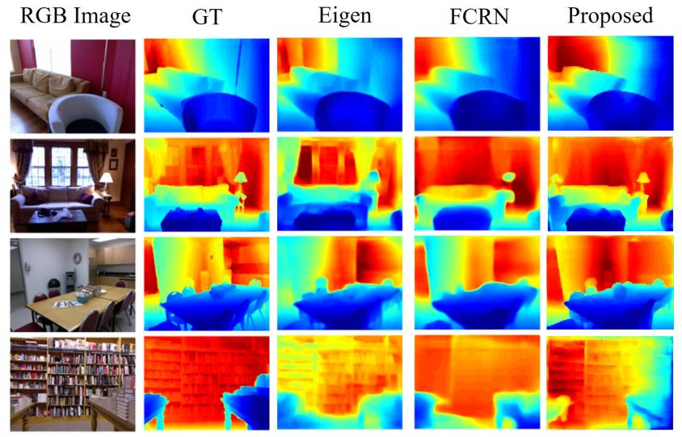
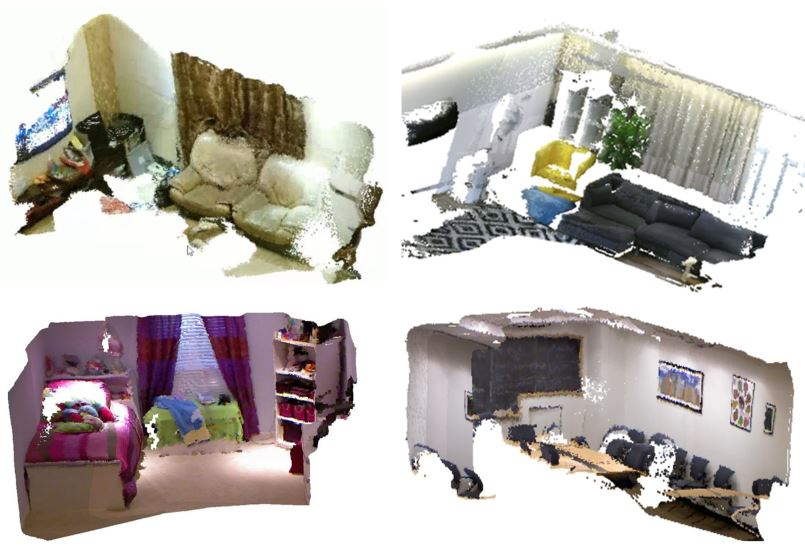

# CNN-MonoFusion
The release code and dataset of CNN-MonoFusion for ismar2018.     


# Introduction
The project contain two submodules (depth-esti/pointcloud-fusion).   

- Network-Archi can be found at [adenet_def.py](./adenet_def/adenet_netdef.py). We name our network as adenet (adaptive-depth-estimation-network), which combined the resnet50/astrous/concat layers and trained using our adaptive-berhu loss.           

- For online depth prediction, you need run [adenet_run_as_server.py](./adenet_run_server/adenet_run_as_server.py) in your server.  

- The [pointcloud-fusion](./pointcloud-fusion/src/dense_map/) is used for fusion stage. We build our system depended on a mono-slam system, so you need to incorpolate our fusion code into a slam sysytem like [ORB-SLAM](https://github.com/raulmur/ORB_SLAM2).     



# Requirements
We run our whole system in Win7&Win10 locally ok.  
You can also running the network on the server compute for accerlating the speed!  

- Tensorflow >= 1.4.0 & CUDA>=8.0   
- Python 3.5.2   
- CMake 3.6.0  
- Visual Studio 2015   
- Optional: kinect-v2 for collecting your own dataset  


# Dataset
All the images are collected by NetEaseAI-CVLab.   
Copyright @2018 CNN-MonoFusion Authors. All rights reserved.  
Please download the NEAIR-dataset [here](https://pan.baidu.com/s/10ATdeutqLaMSxMKaM0A7PQ). 

# Pretrained-Models
You can download our models used in the paper [here](https://github.com/NetEaseAI-CVLab/CNN-MonoFusion/wiki)  

# Citing CNN_MonoFusion (update later) 
If you find CNN_MonoFusion useful in your research, please consider citing:  

```
@article{
    Author = {Jiafang Wang, Haiwei Liu, Lin Cong, Zuoxin Xiahou, and Liming Wang},
    Title = {CNN-MonoFusion: Online Monocular Dense Reconstruction using Learned Depth from Single View},
    Journal = {},
    Year = {}
}
```
